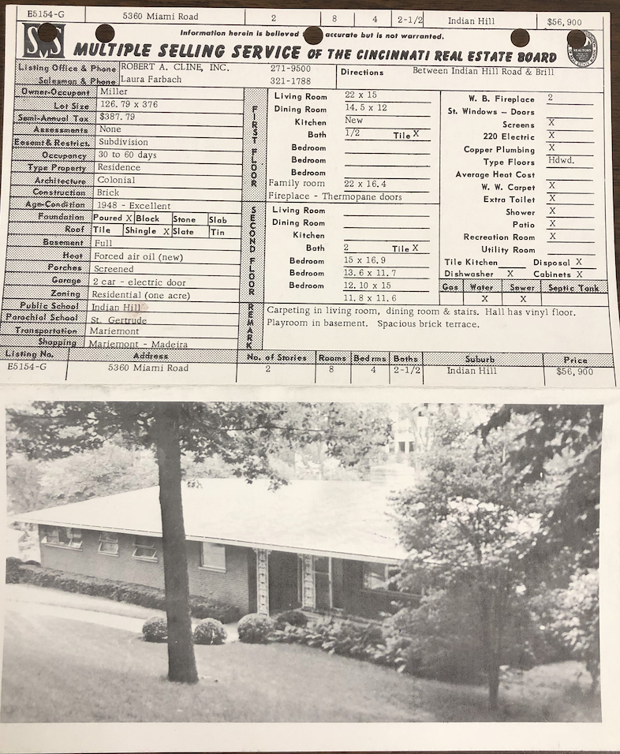

This project explores how spatial data standardization practices shape the design and use of real estate technologies. Focusing on housing in the U.S. real estate industry, it asks: **how do standards, standardizing practices, and the institutions that enforce those practices affect housing?**

During my dissertation research, I became particularly interested in the multiple listing service (MLS), a set of rules and regulations for how professionalized Realtors must share spatial real estate data. This standardization practice was first formulated in the late nineteenth century as a tool for not just exchanging information about property listings, but also as a method for organizing—and even controlling—the circulationg of real estate data and the coordination of real estate markets. The MLS continued without much disruption until 2024, when an antitrust lawsuit handed down by the Department of Justice fundamentally changed the rules of the MLS. My future research draws on legal geographies and an "antitrust framework" for housing studies to conceptualize the MLS as a set of platformed practices that shape markets and direct the flow of spatial real estate data.

[You can read my dissertation here,](https://uknowledge.uky.edu/geography_etds/96/) if you want. Hopefully you'll be able to read something other than my dissertation on the topic soon, too.

|  |
| :----------------------: |
| *a multiple listing service card from the Cincinnati Real Estate Board, ca. 1950* |