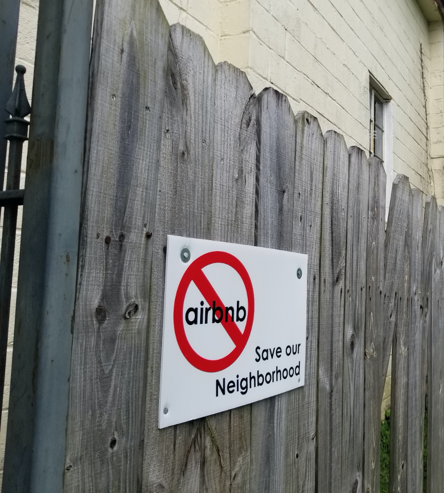

Conducted as part of my MA research between 2017 and 2019, this research explores how short-term rental platforms—particularly Airbnb—reconfigured people's relationships to the places where they lived. Drawing on fieldwork in New Orleans, LA, I found that platforms like Airbnb enrolled people into uneven processes of value capture. By slingshotting travelers into non-touristy, highly residential neighborhods, Airbnb leveraged the emotional labor of proximate neighbors in the process of capturing value for the platform.

Read more here:
* [*Hidden Value in the Platform's Platform*,](https://www.researchgate.net/publication/338039508_Hidden_value_in_the_platform%27s_platform_Airbnb_displacement_and_the_un-homing_spatialities_of_emotional_labor#fullTextFileContent) 2020
* [*Airbnb and the Costs of Emotional Labor in Havana, Cuba*,](https://dl.acm.org/doi/10.1145/3272973.3274066) 2018

|  |
| :-------------------------: |
| *photo of an anti-Airbnb sign in New Orleans, LA, photo by ian, ca. 2017* |